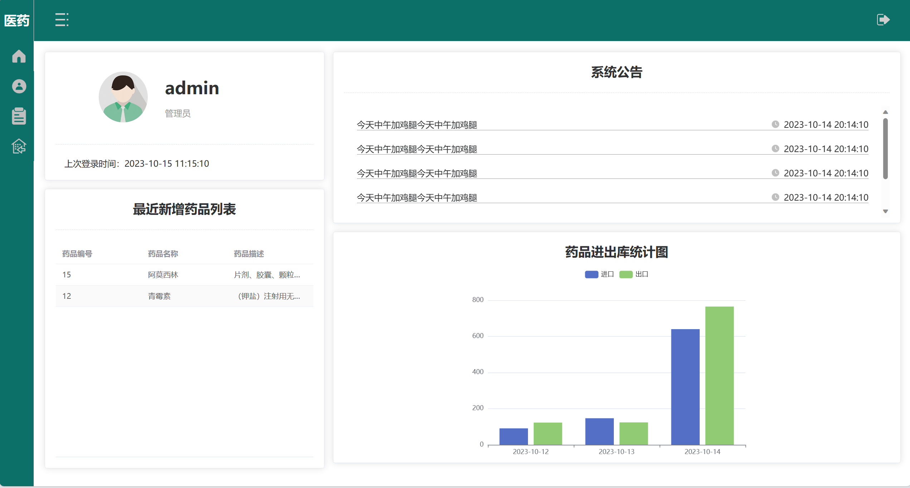
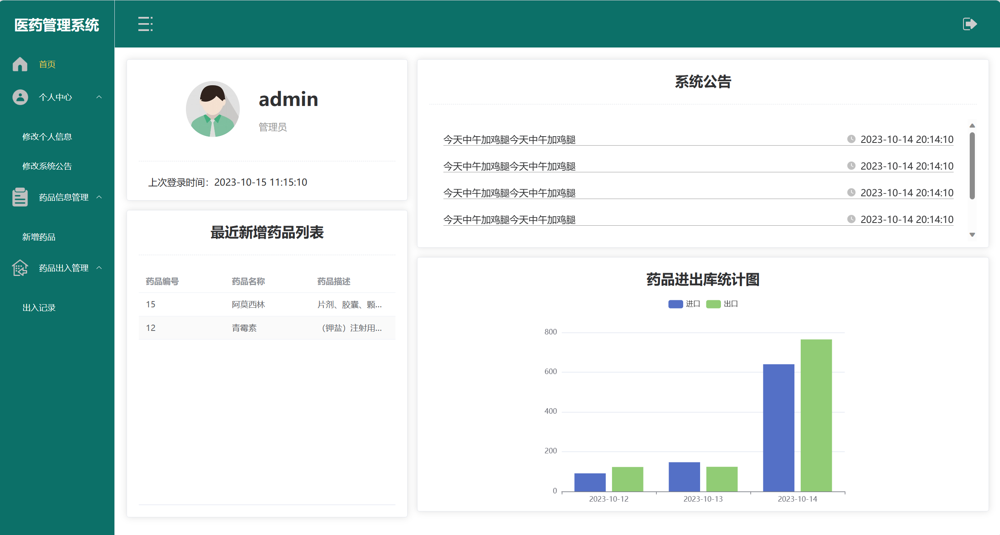
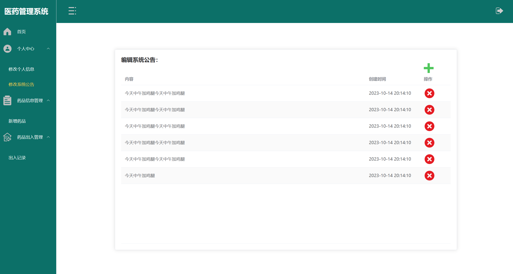
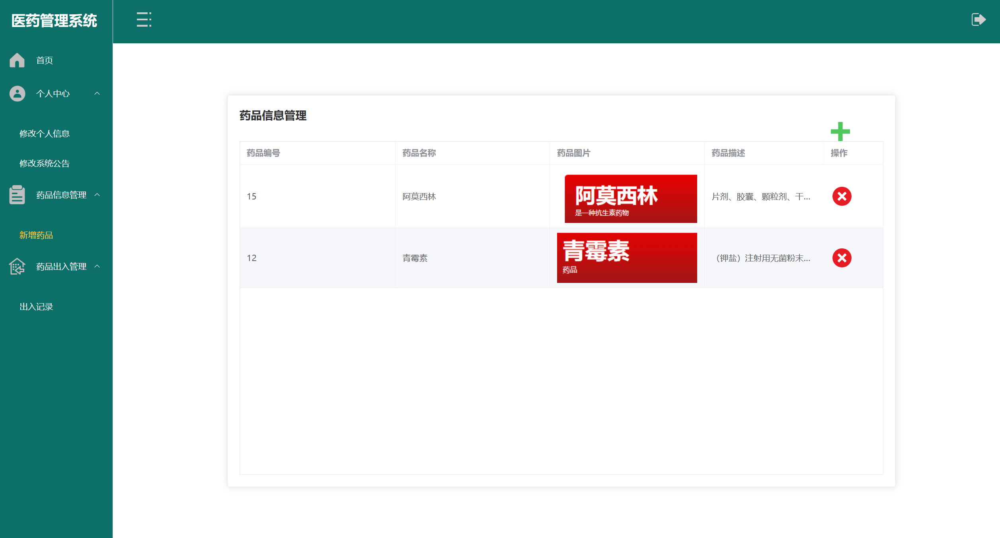
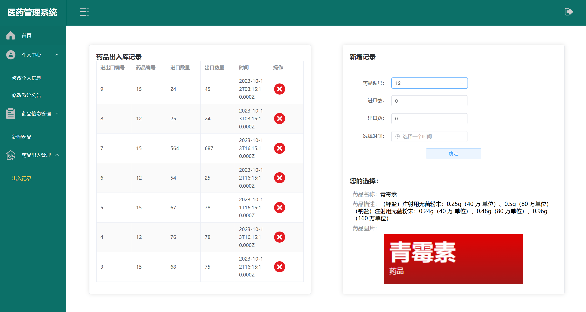
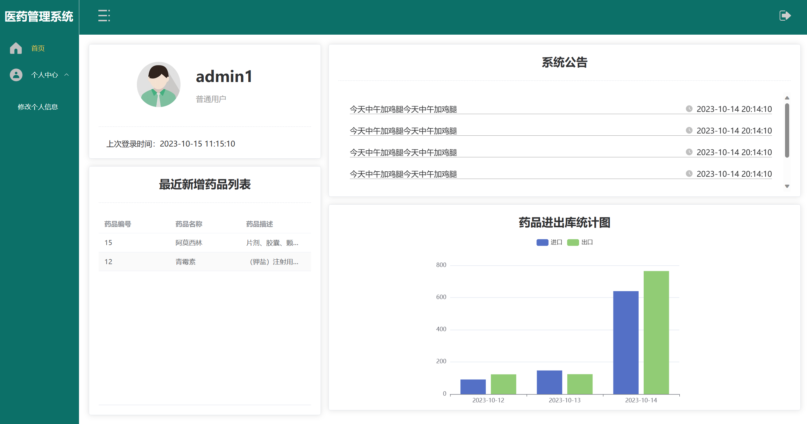

## 医药管理系统

## 运行项目

1. 需要先部署mysql8.0，sql文件位置：[healing_drugs_manage_system.sql](healing_drugs_manage_system_node/db/healing_drugs_manage_system.sql)
2. 推荐使用pnpm

前端：

```cmd
cd healing_drugs_manage_system_web
pnpm i ## 仅第一次运行需要
pnpm run serve
```

若需要构建：pnpm run build

后端：

```cmd
cd healing_drugs_manage_system_node
pnpm i ## 仅第一次运行需要
pnpm start
```













## 普通用户：

